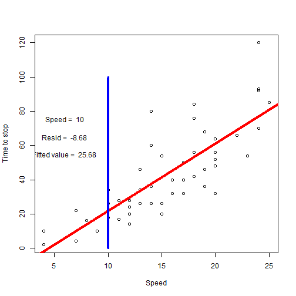

Regression App using shiny
========================================================
author: Alex R
date:  November 23 2014
transition:rotate

Simple Regression App
========================================================

The cars data is available in the UsingR package in R. The dataset has two columns. The first column is speed which denotes the speed at which the car is travelling. The second column is the distance taken to stop the car when braking at the given speed. This app is a simple visual linear regression model to help play with the model. This is how the embedded plot in the app looks like
 

The client side Shiny script
========================================================


```r
shinyUI(pageWithSidebar(
  headerPanel("Residue App"),
  sidebarPanel(
    sliderInput("sp", "Linear residue at Speed", value = 10, min = 4, max = 25, step = 1)
  ),
  mainPanel(
    plotOutput("newPlot")
  )
))
```

The server side Shiny code 
========================================================


```r
library(UsingR)
data(cars)

shinyServer(
  function(input, output) {
    output$newPlot <- renderPlot({
      plot(cars$speed, cars$dist,  xlab='Speed', ylab="Time to stop")
      m1 <- lm(cars$dist~cars$speed)
      abline(m1, col="red", lwd=4)
      sp <- input$sp
      lines(c(sp, sp), c(0, 100),col="blue",lwd=4)
      text(15, 120, paste(" Please adjust slider to see the fitted value and the residual error at the chosen speed"))
      text(6, 75, paste("Speed = ", sp))
      text(6, 65, paste("Resid = ", round(resid(m1)[as.numeric(sp)], 2)))
      text(6, 55, paste("Fitted value = ", round(fitted.values(m1)[as.numeric(sp)], 2)))
    })
    
  }
)
```

The App and the Pitch
========================================================

The full app can be accessed at  http://alexroopesh.shinyapps.io/dataProd.
This simple app is a cool starter app for both aspiring pretend data scientists and shiny app developers. The app

1. Has basic UI and server side scripting and is a fully functional shinyapp
2. Uses basic regression model
3. Represents visually the model and errors
4. Has basic interaction through the slider tool

